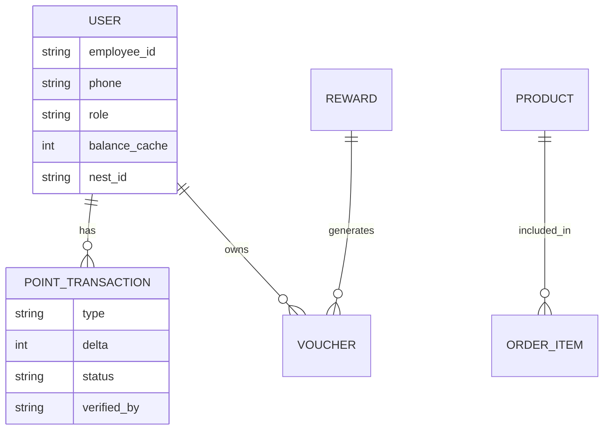

# Nia Studio App - Project Architecture

## 1. Executive Summary
This document outlines the technical architecture for the **Nia Points Web App**, a multi-role platform designed to empower blue-collar migrant workers through a community-driven points and rewards ecosystem. The architecture follows a **Phased Build Strategy** to ensure a functional pilot is ready by March 2026, prioritizing resident experience and staff utility.

---

## 2. Technical Stack
| Layer | Technology | Rationale |
|---|---|---|
| **Frontend** | React + Vite + Tailwind CSS | Modern, performant, and highly productive for AI-assisted development (Antigravity). |
| **Backend** | Node.js + Express | Lightweight, scalable, and easy to deploy on Railway. |
| **Database** | PostgreSQL + Prisma ORM | Relational transparency for append-only transaction ledgers. |
| **Cache** | Redis | High-speed reads for resident point balances. |
| **Auth** | Firebase Auth | Secure Phone OTP and session management. |
| **Hosting** | Vercel (Frontend) + Railway (Backend) | Seamless CI/CD and production-grade stability. |

---

## 3. System Architecture

### 3.1 Frontend Architecture (SPA)
The frontend will transition from the existing Vanilla HTML mockup to a React-based Single Page Application.
- **Component Design System**: Atomic components (Pills, Cards, Modals) based on the "Nia Design Language" (frosted glass, specific hex codes: `#0071e3`, `#bf4800`).
- **State Management**: 
    - `AuthContext`: Manages user roles and session tokens.
    - `PointsContext`: Syncs real-time balance and transaction history.
    - `CartContext`: Preserves bag items across page views.
- **Routing**: Role-based `ProtectedRoute` components to ensure Residents, EAEs, JCOs, and Vendors only see their respective interfaces.

### 3.2 Backend Architecture (REST API)
A monolithic Express server providing the following service domains:
- **Auth Service**: Manages Firebase token verification and PIN-based fallback.
- **Transaction Engine**: Handles all "Earn" and "Redeem" logic with strict ACID compliance to prevent double-spending of points.
- **Voucher Service**: Generates HMAC-signed, single-use QR codes.
- **Staff Service**: Bulk processing for EAE morning checks and JCO approval queues.

---

## 4. Data Model (Core Entities)

---

## 5. Phased Implementation & Operational Mapping

To support the **Manual + Spreadsheet MVP**, the build phases are mapped to operational activities as follows:

### Phase 0: Manual Pilot (Current Operations)
*   **Ledger**: Google Sheets-based per Nest.
*   **Communication**: Weekly WhatsApp summaries & Physical leaderboards.
*   **Redemption**: EAE-verified manual fulfillment.
*   **Architecture Support**: This phase provides the "Schema" and "Logic" used to build the digital system.

### Phase 1: Storefront & Auth (Week 1)
*   **Focus**: Porting `nia-studio-app.html` to React.
*   **Manual Support**: Residents can browse the store digitally while points remain on the physical leaderboard.

### Phase 2: Points Visibility (Week 2)
*   **Focus**: Points UI & Redemption Catalog.
*   **Manual Mapping**: Points context is seeded with data exported from the **Google Sheets Ledger**. residents can see their balance in-app (updated weekly/daily) even before a live DB is ready.

### Phase 3: Staff/EAE Tools (Week 3)
*   **Focus**: Award/Deduct Interface.
*   **Manual Mapping**: EAEs use the app as a "Data Entry" tool. Instead of a DB, the app can generate a "Daily CSV" or simple log that syncs back to the Google Sheets.

### Phase 4: Production Backend (Week 4)
*   **Focus**: Real-time Persistence.
*   **Manual Mapping**: Migration of historical data from Google Sheets into the PostgreSQL Production Ledger. Real-time WhatsApp/Push notifications replace manual messages.

---

## 6. Critical Success Factors
1.  **Pixel-Perfect Preservation**: The existing Store UI (hero, pillar cards, grid) must be carried over exactly to maintain design continuity.
2.  **Append-Only Ledger**: Every point earned or spent must be a row in the `PointTransactions` table. Points are never "edited," only "offset."
3.  **Role Detection**: The app must detect user roles (`Resident`, `EAE`, `JCO`, `Vendor`) immediately upon login and route to the correct layout.
4.  **Mobile First**: 95% of users will access via mobile. Every interaction must be thumb-friendly and high-contrast.

---
**Prepared by**: Antigravity  
**Date**: 26 February 2026
